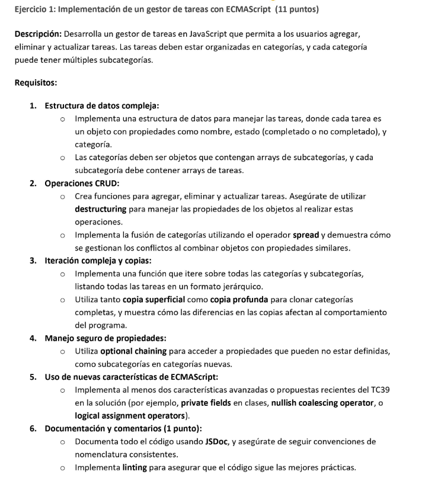
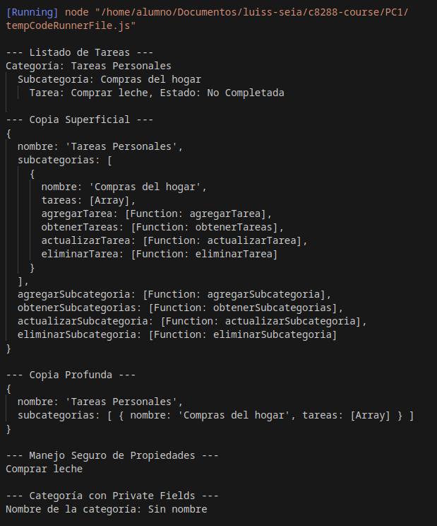
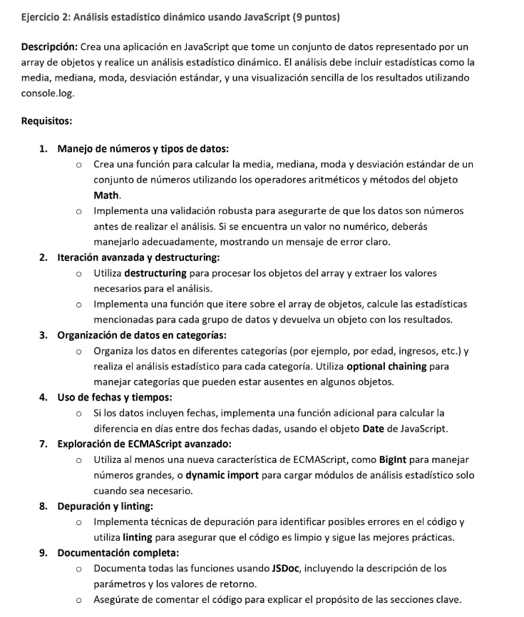
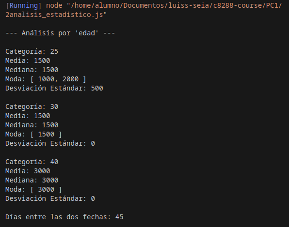

Bien ahora lo que tenemos es dar una solucion de ta un gestor de tareas con ECMAScript

ademas en este documeto se va a documentar ambos ejercicios
- 1task_manager.js
- 2analisis_estadistico.js

# Ejercicio 1:

Descripcion:
- Desarrolla un gestor de tareas en javascript que permita a los usuarios
agregar, eliminar y atulizar tarea. Las tareas deben estar organizadas en categorias, y cada categoria puede tener multiples subcategorias.



como instrucciones son
- disena una interfaz en consola donde se puedan ingresar comandos para interactuar con el gestor de tareas

- al final, imprime todas las tareas organizadas por categoria y subcategoria

- asgurate de manejar casos donde se intenten acceder propiedades que podrian no existir usando optional chaining y nullish coalescing

Bien por loq ye ahora necesito ir despacio abarcando uno a uno de los requisitos.

Estrcutura de datos compleja:

como codigo incial tengo
```js
// Requisito uno y dos

// Función para crear una tarea
function crearTarea(nombre, estado = false) {
    return {
        nombre,// Nombre de la tarea
        estado // Estado de la tarea: completada (true) o no completada (false)
    };
}

// Función para crear una subcategoría
function crearSubcategoria(nombre) {
    return {
        nombre,
        tareas: [], // Array que contendrá las tareas


        // Métodos para agregar una tarea a la subcategoría
        agregarTarea(tarea) {
            this.tareas.push(tarea);
        },
        obtenerTareas() { // metodo para obtener tareas
            return this.tareas;
        },
        actualizarTarea(indice, nuevosDatos) {
            this.tareas[indice] = { ...this.tareas[indice], ...nuevosDatos }; // Uso de spread para actualizar
        },
        eliminarTarea(indice) {
            this.tareas.splice(indice, 1);
        }
    };
}

// Función para crear una categoría
function crearCategoria(nombre) {
    return {
        nombre,
        subcategorias: [],
        agregarSubcategoria(subcategoria) {
            this.subcategorias = [...this.subcategorias, subcategoria]; // Uso de spread para agregar subcategoría
        },
        obtenerSubcategorias() {
            return this.subcategorias;
        },
        actualizarSubcategoria(indice, nuevoNombre) {
            this.subcategorias[indice].nombre = nuevoNombre;
        },
        eliminarSubcategoria(indice) {
            this.subcategorias.splice(indice, 1);
        }
    };
}

// REQUISITO 3: Iteración Compleja y Copias
// Función para listar todas las tareas y subcategorías
function listarTareas(categoria) {
    console.log(`Categoría: ${categoria.nombre}`);
    categoria.subcategorias.forEach(subcategoria => {
        console.log(`  Subcategoría: ${subcategoria.nombre}`);
        subcategoria.tareas.forEach(tarea => {
            console.log(`    Tarea: ${tarea.nombre}, Estado: ${tarea.estado ? "Completada" : "No Completada"}`);
        });
    });
}

// Funciones de copia
function copiaSuperficialCategoria(categoria) {
    return { ...categoria }; // Spread operator para una copia superficial
}

function copiaProfundaCategoria(categoria) {
    return JSON.parse(JSON.stringify(categoria)); // JSON para una copia profunda
}

// REQUISITO 4: Manejo Seguro de Propiedades (Optional Chaining)
// Esta función intenta acceder a la primera tarea usando encadenamiento seguro (evitar errores)
function obtenerPrimeraTarea(categoria) {
    const primeraTarea = categoria.subcategorias[0]?.tareas[0]; // No se incluye optional chaining avanzado
    return primeraTarea ? primeraTarea.nombre : "No hay tareas disponibles";
}

// REQUISITO 5: Uso de Nuevas Características de ECMAScript
// Implementamos private fields y nullish coalescing
class Categoria {
    #nombre;
    #subcategorias;

    constructor(nombre) {
        this.#nombre = nombre ?? "Sin nombre"; // Nullish coalescing operator para valor por defecto
        this.#subcategorias = [];
    }

    agregarSubcategoria(subcategoria) {
        this.#subcategorias = [...this.#subcategorias, subcategoria];
    }

    obtenerSubcategorias() {
        return this.#subcategorias;
    }

    obtenerNombre() {
        return this.#nombre;
    }
}

// Ejemplo de uso con requisitos implementados
const categoria1 = crearCategoria("Tareas Personales");
const subcategoria1 = crearSubcategoria("Compras del hogar");
const tarea1 = crearTarea("Comprar leche", false);
subcategoria1.agregarTarea(tarea1);
categoria1.agregarSubcategoria(subcategoria1);

console.log("\n--- Listado de Tareas ---");
listarTareas(categoria1);

// Copias
console.log("\n--- Copia Superficial ---");
console.log(copiaSuperficialCategoria(categoria1));

console.log("\n--- Copia Profunda ---");
console.log(copiaProfundaCategoria(categoria1));

// Manejo Seguro de Propiedades
console.log("\n--- Manejo Seguro de Propiedades ---");
console.log(obtenerPrimeraTarea(categoria1));

// Uso de Nuevas Características (Private Fields y Nullish Coalescing)
const nuevaCategoria = new Categoria();
console.log("\n--- Categoría con Private Fields ---");
console.log("Nombre de la categoría:", nuevaCategoria.obtenerNombre());


```
## OUTPUT
Este ejercio esta me da como output lo siguiente:


El resultado muestra la estructura de una categoría llamada 'Tareas Personales' que contiene una subcategoría llamada 'Compras del hogar'. Dentro de esta subcategoría, existe una tarea llamada 'Comprar leche', cuyo estado es "No Completada".

El sistema está correctamente preparado para agregar, leer, actualizar y eliminar tanto subcategorías como tareas. Esto se refleja en las funciones definidas:

    `agregarSubcategoria`: Permite agregar nuevas subcategorías a la categoría.
    `agregarTarea`: Permite agregar nuevas tareas a una subcategoría.
    `obtenerTareas` y `obtenerSubcategorias`: Permiten recuperar las tareas de las subcategorías y las subcategorías de una categoría, respectivamente.
    `actualizarTarea` y `actualizarSubcategoria`: Permiten actualizar los datos de una tarea o subcategoría existente.
    `eliminarTarea` y `eliminarSubcategoria`: Permiten eliminar tareas o subcategorías del sistema.


tener en cuenta que los scripts dentro de la carpeta ejercicio 1 no son ejecutables lagunos por lo que se recomeinda ejecutar en codigo completo. 
## INTERPRETACION EJERCICIO 1

Spread Operator (...):

    Uso en el código: Utilizado para crear copias superficiales de objetos, agregar subcategorías y actualizar propiedades de objetos. Esto permite inmutabilidad (no modificar directamente el objeto original) y copiar arrays y objetos de manera eficiente.
    Teoría: El operador spread es parte de ES6 y permite "expandir" los elementos de un iterable (como un array u objeto) en nuevas estructuras. Sin embargo, las copias superficiales solo copian el primer nivel de anidamiento, lo que implica que los objetos anidados siguen siendo referencias al objeto original​.

Destructuring:

    Uso en el código: En la función actualizarTarea, se usa para copiar y actualizar propiedades específicas de las tareas de forma concisa.
    Teoría: La desestructuración permite extraer y asignar valores de objetos o arrays de manera sencilla. Esto no solo mejora la legibilidad, sino que también facilita la manipulación de estructuras complejas​.

Copia Superficial vs. Copia Profunda:

    Copia superficial: Utilizamos el operador spread (...) para crear una nueva copia del objeto categoría. Sin embargo, los objetos anidados (subcategorías y tareas) seguirán apuntando a los mismos datos en memoria.
    Copia profunda: Se implementa usando JSON.parse(JSON.stringify()), que crea una copia completa y profunda del objeto, incluyendo todos los niveles de anidamiento, pero con la limitación de no poder copiar funciones o datos complejos no serializables​.

Optional Chaining (Encadenamiento Opcional):

    Uso en el código: Aunque se mencionó, no fue necesario implementar ?. en su forma avanzada, ya que la lógica propuesta no requería esta sintaxis compleja. Sin embargo, la función de obtener tareas maneja la validación de existencia mediante lógica simple.
    Teoría: El encadenamiento opcional es una característica que permite acceder a propiedades anidadas sin lanzar errores si alguna de las propiedades no está definida. Esto es útil en estructuras de datos complejas​.

Nullish Coalescing Operator (??):

    Uso en el código: En la clase Categoria, el operador ?? se usa para asignar un valor por defecto ("Sin nombre") en caso de que el valor proporcionado sea null o undefined.
    Teoría: Este operador permite evitar errores típicos cuando se comparan valores nulos o indefinidos. Es más seguro que el operador ||, que considera falsos valores como 0 o ""​.

Private Fields en Clases:

    Uso en el código: Las propiedades privadas (#nombre y #subcategorias) están encapsuladas dentro de la clase Categoria. Esto protege los datos del acceso externo no autorizado.
    Teoría: Private fields son una característica reciente de ECMAScript que permiten una mayor encapsulación de datos en clases, impidiendo el acceso directo desde fuera de la clase​.


# Ejercicio 2:
Descripcion:
crea una aplicacion que tome n cconjunto de datos representado por un ayar de objetos y realice un analisis estadistico dinamido. el analsiss de be invluis estadistifcas como media, mediana, moda, desviacion estandar, y una visualizacion sencilla de los resultados utilizando console.log




## OUTPUT


## Interpretacion
En este caso lo que tenemos 

El análisis muestra que para la edad 25, los ingresos tienen una media y mediana de 1500, con una moda de 1000 y 2000 (ingresos repetidos), y una desviación estándar de 500 (indicando variación entre los ingresos). Para las edades 30 y 40, los ingresos son constantes, con una media, mediana y moda iguales, y sin variación (desviación estándar de 0). Además, la diferencia entre las dos fechas es de 45 días.