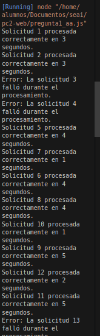
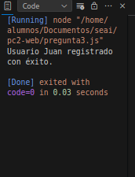
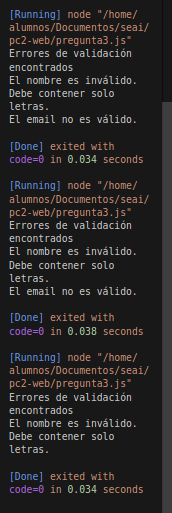

# PC2
En eeste documente estará toda la documentacion relacionada a la resolucion de los tres ejercicios propuestos

## Puntajes
Voy a priorizar por el valor de las preguntas

* Pregunta 1: 7 puntos
* Pregunta 2: 4 puntos
* Pregunta 3: 9 puntos

## Pregunta 1
simulacion de un servidor web con temporizadores y async/await

### Requisitos
* Procesar solicitudes de manera asincrona
    usar:
    * temporizadores
    * intevalos personalizados
* combinar callbacks, promesas y async/away para manehar solicitudes entrantes

### Enunciado 
Implemetar un simulador web que procese solicitides de manera asincrona

#### Detalles del servidor
* procesar sollicitude asincronas
* manejar errores de manera robusta sin detener la ejecucion
* Detenerse automaticamente si no hay nuevas solicitudes en un intervalo de 10''

#### Fases de procesamiento 
1. con callbacks: manejar procesamiento de solicitudes y su cola
2. con promesas: refactorizar para eliminar los callbacks
3. con async/await: refactorizar para usar async/await
    * optimizar el manejo de errores y la gestion de solicitudes pendientes

### Datos de entrada

*    Intervalo de llegada de solicitudes: 2 segundos entre cada solicitud.
*    Cada solicitud tiene un ID único.
*    Cada solicitud tarda entre 1 y 5 segundos en completarse.
*    Hasta 5 solicitudes simultáneamente; las adicionales esperan en cola.
*    Simulación de errores: 20% de las solicitudes fallan.
*    Sin solicitudes en 10 segundos: el servidor se detiene.

### Salida esperada
* Registro exitoso de cada solicitud
    * ID
    * Tiempo de porcesamiento
    * Procesamiento correcto o no
* registro del estado de cola
    * Cola llena indicar nuevas solicitudes en espera
* detener por inactividad y mostrar por falta de nuevas solicitudes.

### code
* [path](/home/alumnos/Documentos/seai/pc2-web/pregunta1_aa.ts)

### Output
tiene alguanbs deficiencias como el code no permit e codig por inactivadad

pero tenemos la secuencia de las tareas cargadas y no con exito




## Pregunta 3
Sistema de registro y validacion con tipos refinados y callbacks
### Requisitos
* validar la entrada de datos de un usuario
    * nombre
    * email
    * phone
    * edad
* utilizar para la validacion
    * tipos refinados
    * callbacks nombrados
    * polimorfismo basado en composicion 
    * tipado estructural
* la validacion no detiene la ejecucion ante errores
* manejar diferentes validaciones de manera asincrona

#### Datos de entrada
- nombre: string
- email: string
- phone: string
- edad: number

#### Salida esperada
1. si los datos son validos, la salida debe ser un objeto que confirme el registro del usuario
```ts
interface registrExitoso {
    status: "success";
    message: string;
}
```

2. si los datos no son validos la salida debe ser un objeto que contenga informacion sobre los errores, pero sin detener la ejecucion
```ts
interface ErrorDeValidacion{
    status: "error";
    message: string;
    detalles: string[];
}
```

### Restricciones adicionales
1. No utilizar funciones anonimas: los callbacks deben ser funciones nombradas 
2. validacion exhaustiva de datos con tipado refinado
3. No se permite try/catch: uso de promesas sin try.catch
4. polimorfismo en interfaces -> no usar herencia tradicional (extends) se debe usar composicion par alograr este comportamiento

5. uso de la tecnica de "structural typing" de TS
### Code
Revisar el file: [pregunta3.ts](/home/alumnos/Documentos/seai/pc2-web/pregunta3.ts)

### output
primero lo que hacemos es transpilar de ts a js 
para ello usamos nodejs

```shell
npm init -y
npm install typescript --save-dev
npx tsc --init
npx tsc <preguntaX>
# tener en cuenta que X es el numero de la preugnta
```

y luego teniendo en cuenta los requicitos de la pregunta obtengo el siguiente output

- datos de entrada
```ts
// Ejemplo de uso
var usuarioEntrada = {
    nombre: "Juan",
    email: "juan@example.com",
    phone: "+1234567890",
    edad: 30,
};
```


En esta prueba notamos que deberia registrar de manera correcta dado que los datos son cargados correctamente


```ts
// Ejemplo de uso
var usuarioEntrada = {
    nombre: "798as",
    email: "juanexample.com",
    phone: "987564546513",
    edad: 30,
};

```
en este caso lo espeardo es que no se guarde con exito



en esta imagen lo que notamos es que en diferenctes tipos de entrada lo que hacemos es que me valide y es por ello que no hay un registro con exito
